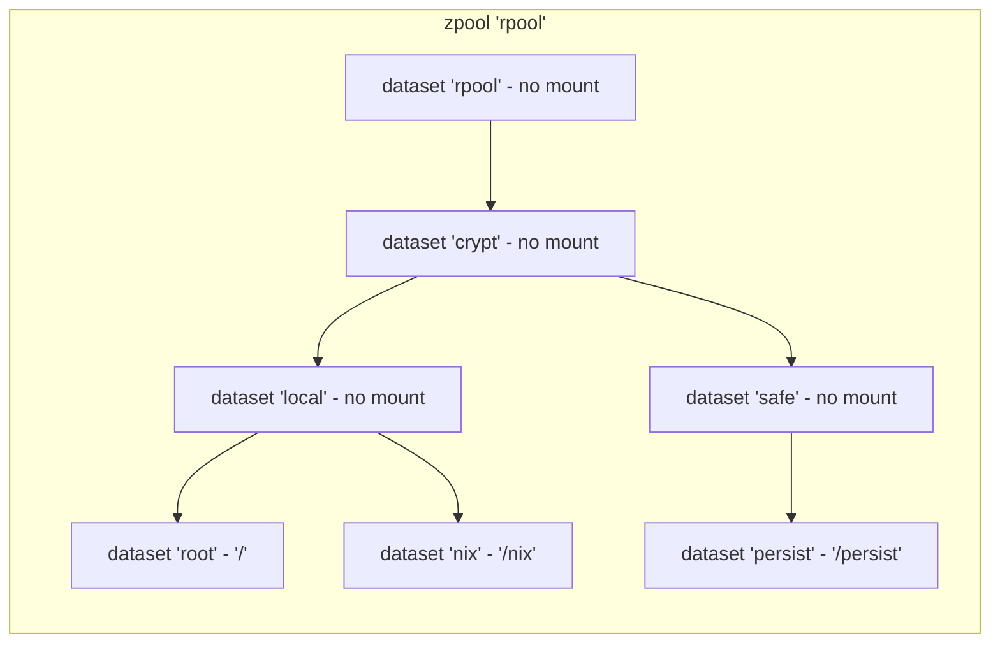

# nix-config

My configs for nixos.

High level overview:

- YubiKey for portable signing / encryption / auth keys across all hosts
- ZFS filesystems with native ZFS encryption for hosts that stay at home
- ZFS filesystems on encrypted LUKS for hosts that travel
- Boot process remote drive decryption for headless machines
- Ephemeral root file system with opt-in persistence via `impermanence`
- Encrypted secrets with `sops-nix`
- VMs with PCI device passthrough via OVMF.
- `sway` / `hyprland` wayland desktop environment
- Locked dependency versions on multiple machines via `flake.lock`

## Repo structure

- `flake.nix`: Flake entrypoint, declaring all hosts and git dependencies. `nixos-rebuild switch --flake .#<host>` to apply a specific system's config.
- `hosts`: NixOS configurations.
  - `common`: Reusable config components.  Some apply to all hosts, some are optional and opt-in.
  - `%hostname%`: System specific config. Anything referencing specific hardware or hardware ids will be nested in these folders.
  - `oak`: Desktop workstation, native ZFS encryption, extensive KVM / QEMU config with hardware passthrough.
  - `redbud`: Laptop, ZFS on encrypted LUKS.
  - `warden`: Intel NUC mini-pc, headless, native ZFS encryption, home-assistant, tailscale exit node.
- `home`: Home-manager configuration. Not currently deployed directly, but imported via the primary NixOS config.
  - Generally, I try to keep as much of my system as possible in user space. User space programs and configurations are managed here.
- `modules`: My own derivations. Most of these are just containers for re-usable config. However some (zfs) implement more complex parameterized config behavior.

## Filesystem features

Hosts all utilize ZFS for non-boot partitions.

### ZFS common topology



All datasets that say "no mount" may not be mounted and instead are policy containers that all children inherit from.

`dataset 'crypt'` is only present on hosts that use ZFS native encryption, for hosts with ZFS on LUKS this dataset isn't present.

### Ephemeral root filesystem

This idea is mostly taken from Graham Christensen's blog post "Erase your darlings".

NixOS boots as long as it has access to `/boot` and `/nix`. If `hyperparabolic.base.zfs.rollbackSnapshot` is specified, `zfs rollback -r %snapshot%` is executed immediately after filesystems are mounted in initrd, in this case rolling back to a blank filesystem snapshot of `/rpool/crypt/local/root`.  By default there is zero config drift, and the system always boots with "new system smell."

[Impermanence](https://nixos.wiki/wiki/Impermanence) allows opt-in persistence of specific files and directories between boots. `/persist` is a mirror of the root filesystem only containing directories and files to persist between boots, and the Impermanence config sets up links in the root filesystem pointing to their persisted counterparts.

Combined with ZFS this has several very nice features. `zfs diff rpool/crypt/local/root@blank` shows every filesystem change that isn't persisted, or temporary snapshots may even be used to see the diff of single commands:

```bash
zfs snapshot rpool/crypt/local/root@tmp1
# do something, install a package, run a command, etc.
zfs diff rpool/crypt/local/root@tmp1
```

### Automatic maintenance and reporting

`zpool scrub` performed on all zpools weekly. Automatic trim runs continuously.

Auto-snapshotting can be configured on a dataset by dataset basis. The `local` and `safe` datasets primarily act as policy containers for these changes. `local` generally doesn't get automatically persisted (only manual snapshots on `.../local/nix` if performing operations that change the nix db in ways that can't be reversed), where `safe` datasets generally automatically keeps a set of rolling snapshots that automatically rotate and may occasionally `zfs send` to perform remote backups. ZFS performs copy on write operations, so these snapshots generally consume little disk space unless you are modifying files regularly.

Any degradation detected during these automatic operations is automatically reported to a centralized location via webhooks using ZED.

## Secrets management

Secrets are stored encrypted in this repo. `sops` is used to encrypt secrets using my YubiKey stored PGP key in addition to each hosts' SSH host keys utilizing age keys. `sops-nix` decrypts these secrets at activation time, keeping them encrypted even in the nix store.

## Virtualization

The host `oak` includes configuration to run VMs with the following features:

- Hardware passthrough, including GPU passthrough via OVMF for near native graphics performance
- Seamless host / vm audio device sharing via pipewire
- Evdev input device passthrough (left-ctrl + right-ctrl to transition mouse and keyboard between host and vm)
- QEMU sandboxing
- All running as a non-root user

## Inspired by

Many ideas pulled from these awesome people:

- https://grahamc.com/blog/erase-your-darlings/
- https://github.com/drduh/YubiKey-Guide
- https://github.com/Misterio77/nix-config
- https://github.com/Aylur/dotfiles

